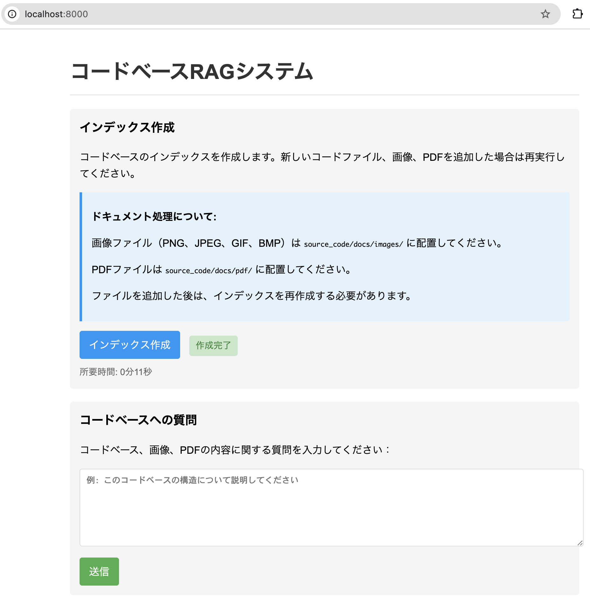

# コードベースRAGシステム

このプロジェクトは、ソースコードリポジトリを分析し、ChromaDBを使用してベクトル化されたインデックスを作成することで、コードベースに関する質問応答システムを提供します。また、画像やPDFからの情報抽出と質問応答機能も備えています。



## 概要

このシステムは以下のコンポーネントで構成されています：

1. **FastAPI アプリケーション**: RESTful APIエンドポイントを提供
2. **ChromaDB**: ベクトルデータベースとして機能
3. **LangChain**: テキスト処理とLLM統合のためのフレームワーク
4. **Anthropic Claude**: 質問応答のためのLLM
5. **Tesseract OCR**: 画像からのテキスト抽出
6. **OpenCV**: 画像処理
7. **PDFPlumber**: PDFからのテキスト抽出

## 機能

### コードベース分析機能

- ソースコードのインデックス作成
- コードベースに関する質問応答
- 関連するソースコードの参照

### ドキュメント処理機能

- 画像からのテキスト抽出（OCR）
  - PNG、JPEG、GIF、BMPなどの画像形式をサポート
  - 日本語と英語のテキスト認識
  - UML図やその他の画像からの情報抽出
- PDFからのテキスト抽出
  - 複数ページのPDFドキュメントをサポート
  - テキスト、表、図表などの抽出
- 抽出されたテキストに基づく質問応答

## ファイル構造

```text/plain
.
├── README.md                # このファイル
├── docker-compose.yml       # Dockerコンテナの設定
├── Dockerfile               # アプリケーションのDockerイメージ定義
├── requirements.txt         # 必要なPythonパッケージ
├── .env                     # 環境変数（APIキーなど）
├── your_app.py              # FastAPIアプリケーション
├── code_indexer.py          # ソースコードのインデックス作成スクリプト
├── code_query.py            # コードベースへの質問処理スクリプト
├── source_code/             # 分析対象のソースコード（マウントポイント）
│   ├── docs/pdf             # 分析対象のPDF(必要であればここにおいてください)
│   └── docs/images          # 分析対象の画像(必要であればここにおいてください)
├── static/                  # 静的ファイル
│   └── images/              # 画像ファイル（UML図など）
└── chroma_db/               # ChromaDBのデータ保存先
```

## 前提条件

- Docker と Docker Compose がインストールされていること
- Anthropic API キー

## セットアップ

1. リポジトリをクローンします
2. `.env` ファイルを作成し、Anthropic API キーを設定します：
   `ANTHROPIC_API_KEY=your_api_key_here`
3. 分析したいソースコードを `source_code` ディレクトリに配置します。デフォルトでは、`./source_code` がコンテナ内の `/code_repo` にマウントされます
4. Docker Compose でコンテナを起動します：

```bash
docker-compose down && docker-compose up -d --build
```

## 使用方法

### Webインターフェース

システムのWebインターフェースにアクセスするには、ブラウザで`http://localhost:8000/`を開きます。

Webインターフェースでは以下の操作が可能です：

1. **インデックス作成**: 「インデックス作成」ボタンをクリックしてコードベースのインデックスを作成
   - インデックス作成プロセスの状態（実行中、完了、エラー）と所要時間が表示されます
   - 新しい画像やPDFファイルを追加した場合は、再度インデックス作成を実行する必要があります
2. **コードベースへの質問**: テキストエリアに質問を入力して「送信」ボタンをクリック
   - コードベース、画像、PDFの内容に関する質問が可能です

### ドキュメントの追加

システムで処理するドキュメントを追加するには、以下のディレクトリにファイルを配置します：

- 画像ファイル（PNG、JPEG、GIF、BMP）: `source_code/docs/images/`
- PDFファイル: `source_code/docs/pdf/`

これらのドキュメントは、インデックス作成時に自動的に処理され、検索可能になります。

**注意**: 新しいドキュメントを追加した後は、必ずWebインターフェースの「インデックス作成」ボタンをクリックして、インデックスを再作成してください。インデックス作成が完了すると、新しく追加したドキュメントの内容も検索対象になります。

### APIエンドポイント

#### インデックスの作成

ソースコードのインデックスを作成するには、以下のAPIエンドポイントを呼び出します：

```bash
curl -X POST http://localhost:8000/index
```

このプロセスはバックグラウンドで実行され、コードベースのサイズによっては数分かかる場合があります。

#### コードベースへの質問

インデックス作成後、以下のAPIエンドポイントを使用してコードベースに質問できます：

```bash
curl -X POST -H "Content-Type: application/json" -d '{"question": "このコードベースの構造について説明してください"}' http://localhost:8000/query
```

レスポンスには、質問に対する回答と、回答の根拠となったソースコードの参照が含まれます。

#### ドキュメント処理

画像やPDFをアップロードしてテキストを抽出するには、以下のAPIエンドポイントを使用します：

```bash
# 画像処理
curl -X POST -F "file=@/path/to/your/image.png" -F "question=この図の主要なコンポーネントは何ですか？" http://localhost:8000/process_image

# PDFファイル処理
curl -X POST -F "file=@/path/to/your/document.pdf" -F "question=このドキュメントの主要な内容は何ですか？" http://localhost:8000/process_pdf
```

Base64エンコードされた画像データを処理するには、以下のAPIエンドポイントを使用します：

```bash
curl -X POST -H "Content-Type: application/json" -d '{"image_data": "BASE64_ENCODED_IMAGE_DATA", "question": "この図の主要なコンポーネントは何ですか？"}' http://localhost:8000/process_image_base64
```

レスポンスには、抽出されたテキストと、質問がある場合はその回答が含まれます。

## 設定のカスタマイズ

### コードインデクサーの設定

`code_indexer.py` ファイルで以下の設定を変更できます：

- `CHUNK_SIZE`: テキストチャンクのサイズ（デフォルト: 1000）
- `CHUNK_OVERLAP`: チャンク間のオーバーラップ（デフォルト: 200）
- `EXTENSIONS`: インデックスに含めるファイル拡張子
- `IMAGE_EXTENSIONS`: 処理対象の画像ファイル拡張子
- `PDF_EXTENSIONS`: 処理対象のPDFファイル拡張子

### クエリの設定

`code_query.py` ファイルで以下の設定を変更できます：

- LLMのモデル名とパラメータ
- 検索結果の数（`k`パラメータ）

### 画像処理の設定

`your_app.py` ファイルで以下の設定を変更できます：

- OCRの言語設定（デフォルト: `jpn+eng`）
- 画像処理のパラメータ

## トラブルシューティング

### インデックス作成の問題

インデックス作成中に問題が発生した場合は、以下のコマンドでログを確認できます：

```bash
docker logs rag_test-langchain-app-1
```

または、コンテナ内で直接インデクサーを実行することもできます：

```bash
docker exec -it rag_test-langchain-app-1 python code_indexer.py
```

### ChromaDBの接続問題

ChromaDBへの接続に問題がある場合は、以下のコマンドでChromaDBコンテナのログを確認できます：

```bash
docker logs rag_test-chroma-1
```

### ドキュメント処理の問題

画像やPDF処理に問題がある場合は、以下を確認してください：

1. Tesseract OCRが正しくインストールされていること
2. 画像が鮮明で、テキストが読み取り可能であること
3. 適切な言語パックがインストールされていること
4. PDFファイルが破損していないこと
5. PDFファイルがテキストレイヤーを含んでいること（スキャンされたPDFの場合はOCR処理が必要）

## 更新履歴

### 2023年11月更新

- PDFファイル処理機能の追加
- PDFPlumberライブラリを使用したテキスト抽出の実装
- 画像処理機能の改善（PNG、JPEG、GIF、BMPなどの複数形式をサポート）
- ドキュメント処理のためのディレクトリ構造の整理

## ライセンス

このプロジェクトはMITライセンスの下で公開されています。
